# ERD

資料模型來源：`prisma/schema.prisma`。

## 高階關聯圖

```mermaid
erDiagram
  User ||--o{ WorkspaceUser : belongs_to
  Workspace ||--o{ WorkspaceUser : has_members
  Workspace ||--o{ Channel : owns
  Channel ||--o{ Contact : has
  Channel ||--o{ Conversation : has
  Channel ||--o{ Message : has
  Contact ||--o{ Conversation : has
  Conversation ||--o{ Message : has
  User ||--o{ Conversation : assigned

  Workspace ||--o{ Tag : owns
  Contact ||--o{ ContactTag : tagged
  Tag ||--o{ ContactTag : tags
  Workspace ||--o{ Segment : owns
  Workspace ||--o{ ContactFieldDefinition : defines
  Contact ||--o{ ContactFieldValue : has
  ContactFieldDefinition ||--o{ ContactFieldValue : stores

  Workspace ||--o{ AutomationFolder : owns
  Workspace ||--o{ Automation : owns
  AutomationFolder ||--o{ Automation : groups
  Automation ||--o{ AutomationStep : has
  Automation ||--o{ AutomationRun : runs
  Contact ||--o{ AutomationRun : triggers
  Conversation ||--o{ AutomationRun : context

  Workspace ||--o{ Broadcast : owns
  Workspace ||--o{ Job : queues
  Workspace ||--o{ Sequence : owns
  Sequence ||--o{ SequenceStep : has
  Sequence ||--o{ SequenceSubscription : has
  Contact ||--o{ SequenceSubscription : subscribes

  Workspace ||--o{ KnowledgeBaseItem : owns
  Workspace ||--o{ WorkspaceAiSetting : configures
  Workspace ||--o{ WorkspaceAiCredential : stores

  Workspace ||--o{ Subscription : has
  User ||--o{ Subscription : owns
  Workspace ||--o{ Invoice : has
  User ||--o{ Invoice : billed
  Subscription ||--o{ Invoice : bills
  Invoice ||--o{ InvoiceItem : has
  Workspace ||--o{ PaymentOrder : has
  User ||--o{ PaymentOrder : pays
  Invoice ||--o{ PaymentOrder : paid_by
  Subscription ||--o{ PaymentOrder : creates
  Subscription ||--o{ SubscriptionAddon : has
  Workspace ||--o{ UsagePeriod : tracks
  Workspace ||--o{ MessageEventLedger : records
  Contact ||--o{ MessageEventLedger : relates

  User ||--o{ ReferralCode : owns
  User ||--o{ ReferralAttribution : referrer
  User ||--o{ ReferralAttribution : referred
  User ||--o{ ReferralReward : referrer
  User ||--o{ ReferralReward : referred
  User ||--o{ WalletLedger : has
  Workspace ||--o{ WalletLedger : scopes

  User ||--o| AffiliateProfile : has
  User ||--o{ AffiliateCommission : affiliate
  User ||--o{ AffiliateCommission : referred
  Invoice ||--o{ AffiliateCommission : source
  PaymentOrder ||--o{ AffiliateCommission : source
  User ||--o{ PayoutRequest : requests
  PayoutBatch ||--o{ PayoutBatchItem : contains
  PayoutRequest ||--o{ PayoutBatchItem : item
  Workspace ||--o{ Coupon : owns
```

## Model 分組

### Identity / Workspace

| Model           | 用途                                         |
| --------------- | -------------------------------------------- |
| `User`          | 登入使用者、角色、付款、推薦與聯盟關聯主體。 |
| `Workspace`     | 多租戶工作區。                               |
| `WorkspaceUser` | User 與 Workspace 的 membership。            |

### Channels / Inbox

| Model                    | 用途                                                                        |
| ------------------------ | --------------------------------------------------------------------------- |
| `Channel`                | mock、telegram、instagram、messenger、whatsapp、tiktok、sms、email 等渠道。 |
| `Contact`                | 渠道內的聯絡人。`channelId + externalId` 唯一。                             |
| `Conversation`           | 聯絡人的對話狀態、指派、提醒、未讀。                                        |
| `Message`                | inbound/outbound/system 訊息。                                              |
| `Tag`                    | workspace-scoped 標籤。                                                     |
| `ContactTag`             | Contact 與 Tag 的多對多關聯。                                               |
| `ContactFieldDefinition` | workspace-scoped 自訂欄位定義。                                             |
| `ContactFieldValue`      | contact 的自訂欄位值。                                                      |
| `Segment`                | 分眾條件，供廣播與營運使用。                                                |

### Automation / Broadcast / Jobs

| Model                  | 用途                                 |
| ---------------------- | ------------------------------------ |
| `AutomationFolder`     | 自動化資料夾。                       |
| `Automation`           | 自動化流程與 trigger 設定。          |
| `AutomationStep`       | 流程步驟，依 `order` 排序。          |
| `AutomationRun`        | 自動化執行紀錄。                     |
| `Broadcast`            | 廣播活動、受眾設定、訊息內容與狀態。 |
| `Job`                  | worker job queue。                   |
| `Sequence`             | 序列推播。                           |
| `SequenceStep`         | 序列步驟與延遲設定。                 |
| `SequenceSubscription` | contact 訂閱 sequence 的狀態。       |
| `KnowledgeBaseItem`    | AI FAQ 知識庫。                      |

### AI

| Model                   | 用途                               |
| ----------------------- | ---------------------------------- |
| `WorkspaceAiSetting`    | workspace AI provider/model 設定。 |
| `WorkspaceAiCredential` | workspace AI credential。          |
| `AiModelCache`          | provider model cache。             |

### Billing / Usage

| Model                    | 用途                        |
| ------------------------ | --------------------------- |
| `Subscription`           | workspace/user 訂閱。       |
| `SubscriptionAddon`      | 加購項目。                  |
| `PaymentOrder`           | PayUNI 訂單。               |
| `Invoice`                | 發票/帳單。                 |
| `InvoiceItem`            | 帳單明細。                  |
| `UsagePeriod`            | 週期用量。                  |
| `MessageEventLedger`     | message event 計費 ledger。 |
| `WorkspaceUsageOverride` | workspace 用量上限覆寫。    |

### Referral / Affiliate / Wallet

| Model                 | 用途                     |
| --------------------- | ------------------------ |
| `ReferralCode`        | 使用者推薦碼。           |
| `ReferralAttribution` | 推薦關聯。               |
| `ReferralReward`      | 推薦獎勵。               |
| `WalletLedger`        | 折抵金與錢包流水。       |
| `AffiliateProfile`    | 聯盟夥伴資料與審核狀態。 |
| `AffiliateCommission` | 聯盟佣金。               |
| `PayoutRequest`       | 提領申請。               |
| `PayoutBatch`         | 提領批次。               |
| `PayoutBatchItem`     | 提領批次明細。           |
| `Coupon`              | 優惠碼。                 |

## 重要索引與唯一性

| Model                  | Constraint / Index                                              | 用途                            |
| ---------------------- | --------------------------------------------------------------- | ------------------------------- |
| `Channel`              | `@@unique([workspaceId, type, name])`                           | 避免同 workspace 重複渠道名稱。 |
| `Contact`              | `@@unique([channelId, externalId])`                             | 同渠道內外部使用者唯一。        |
| `Conversation`         | `status`, `assignedToId`, `reminderAt`, `lastMessageAt` indexes | Inbox 查詢與排序。              |
| `Tag`                  | `@@unique([workspaceId, name])`                                 | 同 workspace 標籤唯一。         |
| `Segment`              | `@@unique([workspaceId, name])`                                 | 同 workspace 分眾唯一。         |
| `AutomationStep`       | `@@unique([automationId, order])`                               | 保證流程步驟順序唯一。          |
| `SequenceStep`         | `@@unique([sequenceId, order])`                                 | 保證序列步驟順序唯一。          |
| `SequenceSubscription` | `@@unique([sequenceId, contactId])`                             | 避免重複訂閱。                  |
| `Job`                  | `@@index([status, runAt])`                                      | worker 取 queue。               |
| `UsagePeriod`          | `@@unique([workspaceId, periodStart, periodEnd])`               | 用量週期唯一。                  |
| `AffiliateCommission`  | `@@unique([invoiceId, affiliateUserId])`                        | 避免同帳單重複佣金。            |

## 多租戶原則

- 主要資料以 `workspaceId` 隔離。
- Contact 透過 Channel 回到 Workspace。
- API route 需使用 `getCurrentWorkspaceId()` 或 channel scope 查詢。
- Supabase RLS 參考 [security/supabase-rls-fix.sql](./security/supabase-rls-fix.sql)。
