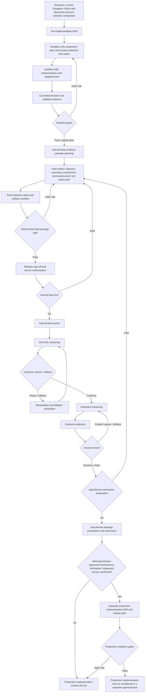

# Meta Business Login Final Doc Index And Production Decision Map

Date: 2026-06-17
Status: Final documentation index / App Review submission preparation Hold / production implementation No-Go

## Scope

This document is the final index for the current Meta Business Login / Instagram Business Login research, sandbox, internal beta, App Review, monitoring, and closeout documentation set.

It summarizes the current decision path before any future production implementation can be considered.

This document does not change:

- Product functionality code.
- OAuth flow.
- Callback route.
- Login button.
- Environment variables.
- Prisma schema.
- Supabase migration state.
- Production ConnectedAccount / Channel records.
- Real Meta token exchange.

Supabase safety rule:

```text
Do not run Supabase migration or db push for this documentation phase.
Before any future Supabase migration or db push, first show current project_id, linked project, and Supabase account email, then wait for explicit confirmation.
```

Sensitive data rule:

```text
Do not store raw token, authorization code, raw state, raw nonce, full callback URL, app secret, client secret, webhook verify token, API key, database URL, Supabase key, cookie, browser storage, credential, OTP, unmasked asset ID, or real customer data in docs, logs, audit output, test output, screenshots, or recordings.
```

## 1. Current Meta Business Login Documents And Purpose

### 1.1 Research And Decision Foundation

| Document | Purpose | Current status |
| --- | --- | --- |
| `docs/meta-login-account-selection-analysis.md` | Documents the current Instagram OAuth account-selection behavior, authorize URL shape, ManyChat comparison, and feasibility constraints. | Research reference / current flow unchanged |
| `docs/meta-business-login-experiment-spec.md` | Defines the early experiment scope for Facebook Login for Business / Instagram Business Login as a candidate replacement path. | Experiment spec / production not approved |
| `docs/meta-app-review-checklist.md` | Tracks Meta App Review readiness and scope implications. | App Review readiness Hold |
| `docs/meta-business-login-app-review-demo-script.md` | Defines the reviewer demo flow, permission usage table, and recording script. | Draft demo script |
| `docs/meta-business-login-account-selection-test-matrix.md` | Defines account-selection scenarios across logged-out, single-account, multi-account, desktop, mobile, popup, and redirect transport. | Test matrix / evidence partially collected |
| `docs/adr-meta-business-login-before-implementation.md` | Records the pre-implementation ADR comparing Facebook Login for Business, Instagram Business Login, and keeping the current flow. | ADR / recommends sandbox-only before production |

### 1.2 Sandbox Planning, Evidence, And SBL Test Scaffolding

| Document | Purpose | Current status |
| --- | --- | --- |
| `docs/meta-business-login-sandbox-implementation-plan.md` | Defines sandbox provider naming, isolation, env candidates, authorize URL, callback, state, nonce, code exchange, data mapping, and rollback boundaries. | Sandbox plan / production excluded |
| `docs/meta-business-login-sandbox-runbook-template.md` | Provides the sandbox execution runbook template. | Template / reusable |
| `docs/meta-business-login-sandbox-experiment-report-template.md` | Provides the sandbox experiment report template. | Template / reusable |
| `docs/meta-business-login-sandbox-go-no-go-checklist.md` | Tracks sandbox, internal beta, App Review, and production gates. | Status tracker / internal beta Hold / production No-Go |
| `docs/meta-business-login-sandbox-coding-spec-draft.md` | Defines sandbox coding-only technical spec for internal-only routes, helpers, dry-run payloads, allowlist, and write guards. | Draft coding spec |
| `docs/meta-business-login-sandbox-coding-risk-test-plan.md` | Defines risks and tests before sandbox coding. | Draft risk/test plan |
| `docs/meta-business-login-sandbox-doc-index.md` | Indexes sandbox documents and decision path. | Sandbox index |
| `docs/meta-business-login-sandbox-coding-task-breakdown.md` | Breaks down sandbox coding tasks under dry-run-first boundaries. | Task breakdown |
| `docs/meta-business-login-sandbox-final-readiness-review.md` | Reviews whether sandbox coding can start. | Readiness review |
| `docs/meta-business-login-sandbox-coding-kickoff-checklist.md` | Defines SBL-09 / SBL-01 kickoff gates. | Kickoff checklist |
| `docs/meta-business-login-sandbox-sbl09-test-suite-spec.md` | Defines SBL-09 minimal sandbox tests. | Test suite spec |
| `docs/meta-business-login-sandbox-sbl09-fixture-redaction-spec.md` | Defines safe/unsafe fixtures, redaction assertions, snapshots, and guard fixtures. | Fixture/redaction spec |
| `docs/meta-business-login-sandbox-sbl09-coding-readiness-checklist.md` | Confirms SBL-09 can start coding while SBL-01/internal beta/production remain blocked. | SBL-09 readiness checklist |
| `docs/meta-business-login-sandbox-sbl09-test-command.md` | Records the SBL-09 targeted test command. | Command reference |
| `docs/meta-business-login-sandbox-sbl01-test-command.md` | Records the SBL-01 targeted test command. | Command reference |
| `docs/meta-business-login-sandbox-sbl03-test-command.md` | Records the SBL-03 targeted test command. | Command reference |
| `docs/meta-business-login-sandbox-sbl04-test-command.md` | Records the SBL-04 targeted test command. | Command reference |
| `docs/meta-business-login-sandbox-sbl05-test-command.md` | Records the SBL-05 targeted test command. | Command reference |
| `docs/meta-business-login-sandbox-sbl06-08-test-command.md` | Records SBL-06 through SBL-08 targeted test commands. | Command reference |
| `docs/meta-business-login-sandbox-sbl11-evidence-packet-test-command.md` | Records the SBL-11 evidence packet targeted test command. | Command reference |
| `docs/meta-business-login-sandbox-sbl12-callback-capture-test-command.md` | Records callback capture targeted test command. | Command reference |
| `docs/meta-business-login-sandbox-production-isolation-test-command.md` | Records production-isolation targeted test command. | Command reference |

### 1.3 Sandbox Browser And Controlled Evidence

| Document | Purpose | Current status |
| --- | --- | --- |
| `docs/meta-business-login-sandbox-browser-evidence-run-2026-06-15.md` | Records initial browser evidence for sandbox account-selection investigation. | Evidence record |
| `docs/meta-business-login-sandbox-authenticated-browser-evidence-run-2026-06-15.md` | Records authenticated browser evidence. | Evidence record |
| `docs/meta-business-login-sandbox-oauth-profile-selection-run-2026-06-16.md` | Records OAuth profile-selection behavior. | Evidence record |
| `docs/meta-business-login-sandbox-controlled-callback-capture-plan.md` | Defines the controlled callback capture plan. | Plan |
| `docs/meta-business-login-sandbox-next-controlled-callback-prompt.md` | Provides next-step controlled callback prompt. | Handoff prompt |
| `docs/meta-business-login-sandbox-controlled-consent-run-2026-06-16.md` | Records controlled consent and redacted callback capture evidence. | Evidence record / callback capture Pass |
| `docs/meta-business-login-sandbox-sbl13-workspace-linking-sync-dry-run.md` | Records workspace linking and channel sync dry-run validation. | Evidence record / dry-run Pass |
| `docs/meta-business-login-sandbox-external-evidence-handoff.md` | Defines external evidence handoff expectations. | Handoff reference |
| `docs/meta-business-login-sandbox-implementation-final-report.md` | Summarizes sandbox implementation and evidence status. | Sandbox summary |
| `docs/meta-business-login-sandbox-internal-beta-go-no-go-review.md` | Reviews whether sandbox evidence can move toward internal beta. | Internal beta Hold |
| `docs/meta-business-login-sandbox-internal-beta-access-rollback-runbook.md` | Defines internal beta access and rollback requirements. | Runbook / not executed |

### 1.4 App Review Package Preparation

| Document | Purpose | Current status |
| --- | --- | --- |
| `docs/meta-business-login-final-app-review-demo-package-checklist.md` | Defines final reviewer demo package checklist. | Draft checklist |
| `docs/meta-business-login-final-permission-usage-proof-matrix.md` | Maps each requested/candidate permission to product screens, user actions, data read/write/store behavior, retention, proof, and recommendation. | Draft proof matrix / evidence incomplete |
| `docs/meta-business-login-final-reviewer-recording-shot-list.md` | Defines recording shots for each permission and required redaction. | Draft shot list / recording not captured |
| `docs/meta-business-login-final-redaction-search-execution-report-template.md` | Defines final redaction search report template for App Review artifacts. | Template / not executed |
| `docs/meta-business-login-final-app-review-package-assembly-checklist.md` | Defines final package assembly gates and exclusions. | Draft checklist / package not assembled |

### 1.5 Internal Beta Evidence, Launch, Monitoring, And Closeout

| Document | Purpose | Current status |
| --- | --- | --- |
| `docs/meta-business-login-internal-beta-doc-index.md` | Indexes internal beta documents and current stage status. | Internal beta index / Hold |
| `docs/meta-business-login-internal-beta-final-preflight-checklist.md` | Defines final preflight gates before internal beta can move from Hold to Go. | Checklist / not executed |
| `docs/meta-business-login-internal-beta-evidence-collection-runbook.md` | Defines how to collect real evidence safely. | Runbook / not executed |
| `docs/meta-business-login-internal-beta-evidence-execution-report-template.md` | Provides evidence execution result template. | Template / not filled |
| `docs/meta-business-login-internal-beta-release-decision-memo-template.md` | Provides internal beta release decision memo template. | Template / not signed |
| `docs/meta-business-login-internal-beta-launch-checklist.md` | Defines launch checks after internal beta Go. | Checklist / blocked by Hold |
| `docs/meta-business-login-internal-beta-monitoring-report-template.md` | Provides beta monitoring report template. | Template / not executed |
| `docs/meta-business-login-internal-beta-closeout-report-template.md` | Provides early beta closeout report template. | Template / not executed |
| `docs/meta-business-login-internal-beta-real-evidence-execution-plan.md` | Defines the first real artifact evidence execution plan. | Plan / ready to execute |
| `docs/meta-business-login-internal-beta-real-evidence-execution-report-blank-run.md` | Provides blank run fields for real evidence execution. | Blank run / not executed |
| `docs/meta-business-login-internal-beta-artifact-folder-structure-spec.md` | Defines evidence artifact folder and naming rules. | Spec |
| `docs/meta-business-login-internal-beta-artifact-manifest-template.md` | Defines artifact manifest fields. | Template / not filled |
| `docs/meta-business-login-internal-beta-artifact-redaction-review-checklist.md` | Defines artifact redaction review gates. | Checklist / not executed |
| `docs/meta-business-login-internal-beta-final-package-gate-review-template.md` | Defines final package gate review. | Template / not executed |
| `docs/meta-business-login-internal-beta-release-sign-off-checklist.md` | Defines product/engineering/security/App Review/operations sign-off. | Checklist / not signed |
| `docs/meta-business-login-internal-beta-launch-authorization-memo-template.md` | Defines launch authorization memo fields. | Template / not signed |
| `docs/meta-business-login-internal-beta-launch-execution-runbook-template.md` | Defines launch execution runbook. | Template / launch not approved |
| `docs/meta-business-login-internal-beta-first-24h-monitoring-execution-report-template.md` | Defines first-24h monitoring report. | Template / monitoring not started |
| `docs/meta-business-login-internal-beta-continuation-decision-memo-template.md` | Defines continue/pause/rollback decision after first 24h. | Template / not signed |
| `docs/meta-business-login-internal-beta-extended-monitoring-plan-template.md` | Defines extended monitoring plan. | Template / not started |
| `docs/meta-business-login-internal-beta-closeout-readiness-checklist.md` | Defines closeout readiness gates. | Checklist / not executed |
| `docs/meta-business-login-internal-beta-closeout-report-execution-template.md` | Defines final closeout execution report. | Template / closeout not executed |

### 1.6 Supporting Project Status Documents

| Document | Purpose | Current status |
| --- | --- | --- |
| `docs/security-review.md` | Tracks redaction, token/code/secret handling, callback safety, production write guard, and security posture. | Support status / production No-Go |
| `docs/fix-roadmap.md` | Tracks remaining blockers and future work. | Support roadmap |
| `docs/codex-session-log.md` | Tracks Codex session history and evidence updates. | Support session log |

## 2. Recommended Reading Order

Read in this order when making the next stage decision:

1. `docs/meta-login-account-selection-analysis.md`
2. `docs/adr-meta-business-login-before-implementation.md`
3. `docs/meta-business-login-experiment-spec.md`
4. `docs/meta-business-login-account-selection-test-matrix.md`
5. `docs/meta-business-login-sandbox-doc-index.md`
6. `docs/meta-business-login-sandbox-go-no-go-checklist.md`
7. `docs/meta-business-login-sandbox-controlled-consent-run-2026-06-16.md`
8. `docs/meta-business-login-sandbox-sbl13-workspace-linking-sync-dry-run.md`
9. `docs/meta-business-login-sandbox-internal-beta-go-no-go-review.md`
10. `docs/meta-business-login-internal-beta-doc-index.md`
11. `docs/meta-business-login-final-permission-usage-proof-matrix.md`
12. `docs/meta-business-login-final-reviewer-recording-shot-list.md`
13. `docs/meta-business-login-final-redaction-search-execution-report-template.md`
14. `docs/meta-business-login-final-app-review-package-assembly-checklist.md`
15. `docs/meta-business-login-internal-beta-real-evidence-execution-plan.md`
16. `docs/meta-business-login-internal-beta-real-evidence-execution-report-blank-run.md`
17. `docs/meta-business-login-internal-beta-artifact-folder-structure-spec.md`
18. `docs/meta-business-login-internal-beta-artifact-manifest-template.md`
19. `docs/meta-business-login-internal-beta-artifact-redaction-review-checklist.md`
20. `docs/meta-business-login-internal-beta-final-package-gate-review-template.md`
21. `docs/meta-business-login-internal-beta-release-sign-off-checklist.md`
22. `docs/meta-business-login-internal-beta-launch-authorization-memo-template.md`
23. `docs/meta-business-login-internal-beta-launch-execution-runbook-template.md`
24. `docs/meta-business-login-internal-beta-first-24h-monitoring-execution-report-template.md`
25. `docs/meta-business-login-internal-beta-continuation-decision-memo-template.md`
26. `docs/meta-business-login-internal-beta-extended-monitoring-plan-template.md`
27. `docs/meta-business-login-internal-beta-closeout-readiness-checklist.md`
28. `docs/meta-business-login-internal-beta-closeout-report-execution-template.md`
29. `docs/meta-app-review-checklist.md`
30. `docs/security-review.md`
31. `docs/fix-roadmap.md`
32. `docs/codex-session-log.md`

## 3. Production Decision Path



Current decision snapshot:

| Stage | Decision |
| --- | --- |
| Research | Complete enough for sandbox and internal beta planning |
| Sandbox SBL evidence | Partial Pass / controlled callback and dry-run evidence Pass |
| Internal beta | Hold |
| App Review submission preparation | Hold |
| Production implementation | No-Go |

## 4. Template / Draft Documents

### 4.1 Templates Not Yet Filled With Real Execution Results

- `docs/meta-business-login-sandbox-runbook-template.md`
- `docs/meta-business-login-sandbox-experiment-report-template.md`
- `docs/meta-business-login-final-redaction-search-execution-report-template.md`
- `docs/meta-business-login-internal-beta-evidence-execution-report-template.md`
- `docs/meta-business-login-internal-beta-release-decision-memo-template.md`
- `docs/meta-business-login-internal-beta-monitoring-report-template.md`
- `docs/meta-business-login-internal-beta-closeout-report-template.md`
- `docs/meta-business-login-internal-beta-artifact-manifest-template.md`
- `docs/meta-business-login-internal-beta-final-package-gate-review-template.md`
- `docs/meta-business-login-internal-beta-launch-authorization-memo-template.md`
- `docs/meta-business-login-internal-beta-launch-execution-runbook-template.md`
- `docs/meta-business-login-internal-beta-first-24h-monitoring-execution-report-template.md`
- `docs/meta-business-login-internal-beta-continuation-decision-memo-template.md`
- `docs/meta-business-login-internal-beta-extended-monitoring-plan-template.md`
- `docs/meta-business-login-internal-beta-closeout-report-execution-template.md`

### 4.2 Draft Specs, Checklists, And Runbooks

- `docs/meta-business-login-experiment-spec.md`
- `docs/meta-business-login-account-selection-test-matrix.md`
- `docs/meta-business-login-app-review-demo-script.md`
- `docs/meta-business-login-sandbox-implementation-plan.md`
- `docs/meta-business-login-sandbox-coding-spec-draft.md`
- `docs/meta-business-login-sandbox-coding-risk-test-plan.md`
- `docs/meta-business-login-sandbox-coding-task-breakdown.md`
- `docs/meta-business-login-sandbox-coding-kickoff-checklist.md`
- `docs/meta-business-login-sandbox-sbl09-test-suite-spec.md`
- `docs/meta-business-login-sandbox-sbl09-fixture-redaction-spec.md`
- `docs/meta-business-login-final-app-review-demo-package-checklist.md`
- `docs/meta-business-login-final-permission-usage-proof-matrix.md`
- `docs/meta-business-login-final-reviewer-recording-shot-list.md`
- `docs/meta-business-login-final-app-review-package-assembly-checklist.md`
- `docs/meta-business-login-internal-beta-final-preflight-checklist.md`
- `docs/meta-business-login-internal-beta-evidence-collection-runbook.md`
- `docs/meta-business-login-internal-beta-artifact-folder-structure-spec.md`
- `docs/meta-business-login-internal-beta-artifact-redaction-review-checklist.md`
- `docs/meta-business-login-internal-beta-release-sign-off-checklist.md`
- `docs/meta-business-login-internal-beta-launch-checklist.md`
- `docs/meta-business-login-internal-beta-closeout-readiness-checklist.md`

### 4.3 Evidence And Status Records

- `docs/meta-login-account-selection-analysis.md`
- `docs/adr-meta-business-login-before-implementation.md`
- `docs/meta-business-login-sandbox-browser-evidence-run-2026-06-15.md`
- `docs/meta-business-login-sandbox-authenticated-browser-evidence-run-2026-06-15.md`
- `docs/meta-business-login-sandbox-oauth-profile-selection-run-2026-06-16.md`
- `docs/meta-business-login-sandbox-controlled-consent-run-2026-06-16.md`
- `docs/meta-business-login-sandbox-sbl13-workspace-linking-sync-dry-run.md`
- `docs/meta-business-login-sandbox-implementation-final-report.md`
- `docs/meta-business-login-sandbox-doc-index.md`
- `docs/meta-business-login-internal-beta-doc-index.md`
- `docs/meta-business-login-sandbox-go-no-go-checklist.md`

## 5. Gates Not Yet Passed

| Gate | Required before | Current status |
| --- | --- | --- |
| Final App Review package assembly | Internal beta Go / App Review prep | Hold |
| Final redaction search execution against real artifacts | Internal beta Go / App Review prep | Hold |
| Reviewer recording captured and reviewed | Internal beta Go / App Review prep | Hold |
| Screenshot package captured and reviewed | Internal beta Go / App Review prep | Hold |
| Permission proof completed for every kept scope | Internal beta Go / App Review prep | Hold |
| Test asset proof completed | Internal beta Go / App Review prep | Hold |
| Meta Dashboard scope reconciliation | Internal beta Go / App Review prep | Hold |
| Artifact manifest completed | Internal beta Go | Hold |
| Artifact redaction review completed | Internal beta Go | Hold |
| Final package gate review completed | Internal beta Go | Hold |
| Product / engineering / security / App Review / operations sign-off | Internal beta Go | Hold |
| Launch authorization memo signed | Internal beta launch | Hold |
| Internal-only entry point verification | Internal beta launch | Hold |
| Workspace allowlist verification | Internal beta launch | Hold |
| User/admin role verification | Internal beta launch | Hold |
| Rollback / fallback verification | Internal beta launch | Hold |
| Production write guard final verification | Internal beta launch | Hold despite prior sandbox evidence |
| Token exchange guard final verification | Internal beta launch | Hold despite prior sandbox evidence |
| First-24h monitoring execution | Continue / pause / rollback decision | Hold |
| Continuation decision memo | Extended monitoring | Hold |
| Extended monitoring execution | Closeout readiness | Hold |
| Closeout readiness review | Closeout report execution | Hold |
| Closeout report execution | App Review submission preparation | Hold |
| App Review submission preparation decision | App Review package submission | Hold |
| Meta App Review submission and approval | Production implementation | Missing |
| Business Verification / Advanced Access confirmation | Production implementation | Missing |
| Separate production implementation ADR | Production implementation | Missing |
| Production env migration plan | Production implementation | Missing |
| Production callback / token exchange / token storage review | Production implementation | Missing |
| Production ConnectedAccount / Channel write approval | Production implementation | Missing |
| Webhook registration and channel sync lifecycle approval | Production implementation | Missing |
| Tenant isolation regression for real assets | Production implementation | Missing |
| Production rollback / monitoring plan | Production implementation | Missing |

## 6. App Review Submission Preparation Status

Current decision:

```text
App Review submission preparation: Hold
```

Reasoning:

- The final package assembly checklist has not been executed against actual artifacts.
- The final redaction report has not been executed against recordings, screenshots, docs, logs, audit exports, and test output.
- Reviewer recording and screenshot evidence are not captured and reviewed.
- Permission proof and test asset proof are incomplete.
- Meta Dashboard scope reconciliation is not complete.
- Internal beta is still Hold.
- Internal beta monitoring and closeout have not completed.
- Release sign-off and launch authorization are not signed.

App Review submission preparation can start only after the real artifact package, redaction report, permission proof, test asset proof, sign-off, launch evidence, monitoring evidence, and closeout decision are complete and reviewed.

## 7. Why Production Implementation Still Cannot Start

Current decision:

```text
Production implementation: No-Go
```

Production implementation still cannot start because:

- App Review has not been submitted or approved.
- Business Verification / Advanced Access status is not confirmed for the final scope set.
- App Review submission preparation is still Hold.
- Internal beta is still Hold.
- No internal beta launch, monitoring, or closeout evidence exists yet.
- Final redaction search against the real App Review/internal beta package is not complete.
- Production env migration plan is not approved.
- Supabase migration or db push has not been reviewed or confirmed for this provider.
- Production OAuth, callback, token exchange, token storage, refresh, revocation, and expiry lifecycle are not approved for this provider.
- Production ConnectedAccount / Channel writes remain intentionally blocked in sandbox evidence.
- Webhook registration and channel sync lifecycle for real Meta assets are not approved.
- Tenant isolation regression for real Business / Page / IG asset writes is incomplete.
- Production rollback, monitoring, and incident response plan are incomplete.
- Existing Instagram OAuth fallback must remain available until a separate production implementation ADR is approved.

## 8. Missing Evidence, Review, And Sign-Off Before Production Implementation

Production implementation requires all of the following before a separate production task can be opened:

| Area | Missing requirement |
| --- | --- |
| Real artifacts | Reviewer recording, screenshots, permission proof, test asset proof, artifact manifest, and package references. |
| Redaction | Final redaction search execution report with zero unresolved sensitive-data findings. |
| App Review | Final package assembly, Meta Dashboard scope reconciliation, App Review submission, and Meta approval. |
| Access control | Internal-only entry point evidence, workspace allowlist evidence, and user/admin role evidence. |
| Guard evidence | Production write guard and token exchange guard evidence during internal beta launch and monitoring. |
| Fallback / rollback | Verified fallback to existing Instagram OAuth and tested beta disable/rollback procedure. |
| Internal beta | Release sign-off, launch authorization, first-24h monitoring, continuation decision, extended monitoring, closeout readiness, and closeout report. |
| Security | Token/code/secret redaction verification, callback safety review, workspace isolation review, and audit/log safety review. |
| Product approval | Product, engineering, security, App Review, and operations sign-off. |
| Meta requirements | Business Verification / Advanced Access confirmation for the final scopes. |
| Production architecture | Separate production implementation ADR covering env, callback, token exchange, token storage, webhook registration, channel sync, tenant isolation, monitoring, rollback, and release plan. |

## 9. Explicit Production-Phase Restrictions

These restrictions remain active until a separate approved production implementation task exists:

- Do not run Supabase migration.
- Do not run Supabase `db push`.
- Do not modify the production OAuth flow.
- Do not modify the callback route.
- Do not modify the login button.
- Do not modify environment variables.
- Do not modify Prisma schema.
- Do not create or update production ConnectedAccount / Channel records.
- Do not perform real Meta token exchange.
- Do not store raw token, authorization code, raw state, raw nonce, full callback URL, app secret, client secret, webhook verify token, API key, database URL, Supabase key, cookie, browser storage, credential, OTP, unmasked asset ID, or real customer data.

Future Supabase reminder:

```text
If a future task requires Supabase migration or db push, first display:
1. Current project_id
2. Current linked project
3. Current Supabase account email

Then wait for explicit confirmation before running db push.
```

## 10. Next Executable Task Suggestions

Recommended next executable task:

```text
請根據 docs/meta-business-login-final-doc-index-and-production-decision-map.md、
docs/meta-business-login-internal-beta-real-evidence-execution-plan.md、
docs/meta-business-login-internal-beta-artifact-folder-structure-spec.md、
docs/meta-business-login-internal-beta-artifact-manifest-template.md，
建立 Meta Business Login internal beta real artifact collection execution checklist。

請只新增 / 更新文件，不要改產品功能程式碼，不要改 OAuth flow，不要改 callback route，
不要改登入按鈕，不要改 env，不要改 Prisma schema，不要執行 Supabase migration。

檔案路徑：
docs/meta-business-login-internal-beta-real-artifact-collection-execution-checklist.md

內容需包含：
1. reviewer recording / screenshots / permission proof / test asset proof 的實際 artifact 收集步驟
2. 每個 artifact 的 owner / version / redaction gate / manifest reference
3. final redaction search 前後的 quarantine / excluded artifact 處理規則
4. internal-only access / workspace allowlist / user role / rollback / guard 的實測順序
5. 完成後要回填哪些 template
6. internal beta Go / Hold 判定方式
7. App Review submission preparation 是否可開始的判定方式
8. production implementation 仍不可開始的原因
9. 不執行 Supabase migration / 不修改正式 OAuth flow 的限制

完成後執行 git status、targeted tests、npm run lint、npm run build，commit 並 push master。
```

Alternative next executable task:

```text
請依照 docs/meta-business-login-final-redaction-search-execution-report-template.md，
建立第一份 final redaction search blank execution run，準備實際檢查 App Review package artifacts。
```

## Final Decision

```text
Final document index: Ready
Research phase: Complete enough for sandbox and internal beta planning
Sandbox evidence: Partial Pass, with controlled callback and dry-run evidence Pass
Internal beta: Hold
App Review submission preparation: Hold
Production implementation: No-Go

Next best step:
Collect real internal beta artifacts, execute final redaction review, and complete sign-off before any App Review submission preparation or production implementation task.
```
