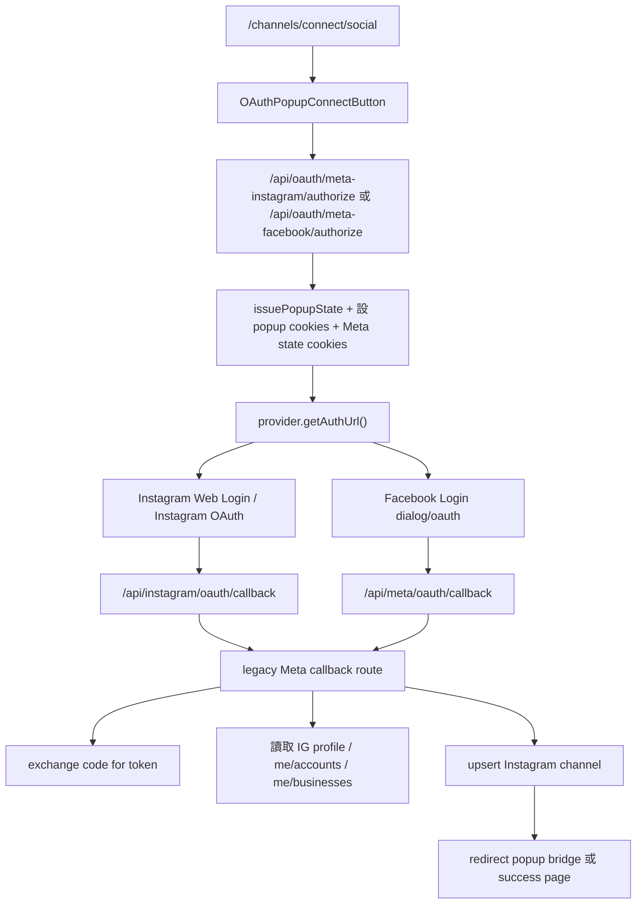

# Meta / Instagram Login Audit

更新日期：2026-06-09

## 結論先講

目前專案實際上同時存在兩套 Meta / Instagram OAuth 路徑：

1. `通用 OAuth authorize 入口`
2. `legacy Meta callback`

畫面上的「Instagram OAuth」與「Facebook / Meta Login」按鈕，目前是從通用 authorize route 進去，但 callback 沒有走通用 `/api/oauth/[provider]/callback`，而是走 legacy：

- Instagram callback：`/api/instagram/oauth/callback`
- Facebook / Meta callback：`/api/meta/oauth/callback`

所以它不是完整的「generic OAuth provider -> generic callback -> ConnectedAccount -> channel sync」；而是：

- `generic authorize`
- `provider-specific auth URL`
- `legacy meta callback`
- `直接 upsert channel`

這也是目前 UX 與資料顯示有一點混線的主因。

## 目前實際使用哪一種登入流程

### 1. Instagram 按鈕

- 類型：`Instagram OAuth / Instagram Business Login 風格`
- 實際入口：`/api/oauth/meta-instagram/authorize`
- authorize URL 來源：`src/lib/oauth/providers/meta-instagram.ts`
- callback：`/api/instagram/oauth/callback` -> re-export 到 `src/app/api/meta/oauth/callback/route.ts`

特徵：

- 使用 `https://www.instagram.com/...` / `https://api.instagram.com/oauth/authorize`
- scope 是 `instagram_business_*`
- `enable_fb_login=0`
- `force_authentication=1`

這條不是 Facebook Login。

### 2. Facebook / Meta 按鈕

- 類型：`Facebook Login`
- 實際入口：`/api/oauth/meta-facebook/authorize`
- authorize URL 來源：`src/lib/oauth/providers/meta-facebook.ts`
- callback：`/api/meta/oauth/callback`

特徵：

- 使用 `https://www.facebook.com/v25.0/dialog/oauth`
- scope 是 `pages_*` + `instagram_*` + `business_management`
- callback 後會抓 `me/accounts` 與 `me/businesses`

這條不是 Instagram Business Login。

### 3. `/api/meta/oauth/start`

這支 route 存在，但目前 UI 沒有接上它當主入口。

它看起來是比較接近 `Meta Business Login / IG onboarding wrapper` 的實驗或備援路徑，支援：

- `mode=instagram | facebook`
- `login=instagram | facebook`
- `switch_account=1`
- `auth_type=reauthenticate`
- `business.facebook.com/business/loginpage/...`

但目前畫面按鈕不是走這支。

## 目前登入流程圖



## 入口、route、component、API、env

### UI / component

- `src/app/channels/connect/social/page.tsx`
- `src/components/oauth/OAuthPopupConnectButton.tsx`
- `src/app/channels/connect/success/page.tsx`

### authorize / callback / sync

- `src/app/api/oauth/[provider]/authorize/route.ts`
- `src/lib/oauth/providers/meta-instagram.ts`
- `src/lib/oauth/providers/meta-facebook.ts`
- `src/app/api/meta/oauth/callback/route.ts`
- `src/app/api/instagram/oauth/callback/route.ts`
- `src/lib/oauth/meta-channel-sync.ts`

### 相關 env

- `META_APP_ID`
- `META_APP_SECRET`
- `META_INSTAGRAM_APP_ID`
- `META_INSTAGRAM_APP_SECRET`
- `META_FACEBOOK_REDIRECT_URI`
- `META_INSTAGRAM_REDIRECT_URI`
- `META_GRAPH_API_VERSION`
- `META_VERIFY_TOKEN`
- `APP_URL`

## 目前 OAuth URL 實際組成

### Instagram

目前按鈕會打到：

`/api/oauth/meta-instagram/authorize?fresh_login=1`

之後 server 產生的實際流程是：

1. 先導向 Instagram login 或 logout/login 頁
2. 再進入 `/oauth/authorize`

實際參數組成：

```text
client_id=<META_INSTAGRAM_APP_ID 或 META_APP_ID>
redirect_uri=<APP_URL>/api/instagram/oauth/callback
response_type=code
state=<server-generated-state>
force_authentication=1
enable_fb_login=0
scope=instagram_business_basic,instagram_business_manage_comments,instagram_business_manage_messages
```

### Facebook / Meta

目前按鈕會打到：

`/api/oauth/meta-facebook/authorize`

實際參數組成：

```text
client_id=<META_APP_ID>
redirect_uri=<APP_URL>/api/meta/oauth/callback
response_type=code
state=<server-generated-state>
scope=public_profile,pages_show_list,pages_read_engagement,pages_manage_metadata,pages_messaging,instagram_basic,instagram_manage_comments,instagram_manage_messages,business_management
auth_type=reauthenticate   # 只有切換帳號/重授權流程才會加
```

## 為什麼現在會直接進入「允許 / 取消」

原因不是 callback，而是 `Meta / Instagram 會沿用瀏覽器既有登入 session`。

也就是說：

1. 如果使用者的瀏覽器本來就登入了 Facebook / Meta / Instagram
2. OAuth dialog 會直接認定「目前登入中的帳號」就是要授權的帳號
3. 於是畫面只剩授權確認，不一定會再出現帳號選擇器

這是平台行為，不是單純前端按鈕 bug。

ManyChat 看起來比較像「先帶出更清楚的登入/切換帳號 UX」，但它也不能無條件強迫 Meta 永遠顯示帳號選擇器。

## 跟 ManyChat 的體驗落差

### 目前缺口

1. 入口沒有明講「請先確認目前瀏覽器登入的是正確帳號」。
2. 缺少明確的「切換帳號 / 重新連接」次要流程。
3. 成功後確認資訊不夠明顯，使用者不容易當下辨識是否綁錯。
4. Facebook Login 的 scope 原本少了 `pages_messaging`、`instagram_manage_comments`、`business_management`。
5. legacy Meta callback 原本沒有把 provider error 和 user-cancel 類錯誤單獨記錄。
6. `/api/meta/oauth/start` 雖然有較多切換帳號參數，但目前 UI 沒有接它。

### ManyChat 比較像怎麼做

1. 先提醒使用者目前瀏覽器登入中的 Meta / IG 身分。
2. 需要時引導使用者重新登入或改用乾淨 session。
3. 成功後立即顯示實際綁定帳號資訊。
4. 綁錯時快速提供重新連接或解除綁定路徑。

## Scope 檢查

### Instagram 直接登入流程

目前 scope：

- `instagram_business_basic`
- `instagram_business_manage_comments`
- `instagram_business_manage_messages`

對於目前產品目標：

- IG 留言觸發
- IG 私訊
- 自動回覆

這組 scope 基本合理。

### Facebook / Meta Login 流程

修正後 scope：

- `public_profile`
- `pages_show_list`
- `pages_read_engagement`
- `pages_manage_metadata`
- `pages_messaging`
- `instagram_basic`
- `instagram_manage_comments`
- `instagram_manage_messages`
- `business_management`

用途對應：

- `pages_show_list`：列出可用粉專
- `pages_read_engagement`：讀粉專 / IG 關聯資產資訊
- `pages_manage_metadata`：做 webhook / subscribed apps 類設定
- `pages_messaging`：Message API / 私訊能力
- `instagram_basic`：讀 IG 基本資料
- `instagram_manage_comments`：留言讀取 / 回覆
- `instagram_manage_messages`：IG DM
- `business_management`：抓 business asset / `/me/businesses`

## 安全檢查

### 已具備

- `state` cookie 驗證
- popup state 驗證
- callback 錯誤分支 audit log
- token 沒有出現在前端 query string
- audit log 已清洗敏感字樣，不記錄 token / secret / code / state

### 現況說明

- `code` 本身由 Meta / Instagram 控制，正常情況只能交換一次，server 端沒有重複使用它。
- token exchange 都在 server route 裡完成，沒有回傳到前端 URL。
- `src/app/api/meta/oauth/callback/route.ts` 已補上：
  - provider error audit
  - invalid state audit
  - catch-all error audit

## 可行修正方案

### 立即可做

1. 在登入按鈕旁加提示，提醒使用者先確認瀏覽器登入中的 IG / Meta 帳號。
2. 增加「切換帳號 / 重新連接」按鈕與流程提示。
3. Facebook Login 加入可控的 `auth_type=reauthenticate`。
4. 補齊 Facebook flow 所需 scope。
5. callback 成功頁顯示：
   - IG 名稱
   - IG username
   - 頭像
   - 綁定粉專名稱（如果有）
6. 成功頁提供「前往 Channels 檢查綁定」與重新連接路徑。
7. provider error / user cancel 類失敗寫入安全 audit log。

### 需要 Meta App 設定配合

1. Facebook Login / Instagram Login redirect URI 必須與目前 legacy callback 路徑一致：
   - `/api/meta/oauth/callback`
   - `/api/instagram/oauth/callback`
2. 如果未來要改成 generic callback，後台 redirect URI 也要一起改。
3. Webhook callback、App domains、privacy policy、data deletion URL 要一致。

### 需要 App Review / 權限審核

1. `instagram_business_manage_messages`
2. `instagram_business_manage_comments`
3. `instagram_business_basic`
4. Facebook flow 的 `pages_*`、`instagram_*`、`business_management`

### 不能保證做到的部分

1. 不能保證每次都像 Google 一樣顯示帳號選擇器。
2. 不能保證 Meta / Instagram 一定忽略既有登入 session。
3. `auth_type=reauthenticate` 比較像強制再驗證，不等於保證跳出「換另一個帳號」畫面。
4. `auth_type=rerequest` 只適合重新要求被拒絕的權限，不是帳號切換器。

## 不可行或受 Meta 限制的地方

1. 無法只靠前端按鈕完全控制 Meta / Instagram 顯示哪個帳號。
2. 無法保證已登入狀態下一定重新出現完整帳號列表。
3. 若使用者在瀏覽器同時保留 Meta session，平台通常優先沿用現有 session。

## 本次建議的最小修改方向

1. 保留現有 `authorize -> legacy callback` 架構，不切 generic callback。
2. 補 UI 提示與次要按鈕。
3. 補 Facebook scope 與 `auth_type`。
4. 補 callback 的 provider error audit。
5. 補 success page 的實際綁定資訊。

## 這次沒有做的事

1. 沒有把整條 Meta legacy callback 改造成 generic provider callback。
2. 沒有把 `/api/meta/oauth/start` 換成主入口。
3. 沒有重構 ConnectedAccount / channel sync 的資料模型。
